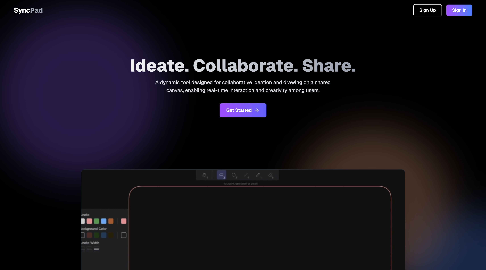

# ✨ SyncPad – Collaborative Drawing Application



SyncPad is a real-time, collaborative drawing application built with **Next.js**, **Express**, **TypeScript**, **Tailwind CSS**, and **Turborepo**. It allows multiple users to draw simultaneously on a shared canvas – no third-party APIs used. The canvas sync logic is handcrafted for optimal control and performance.

## 🧩 Architecture Overview

SyncPad is built with a **DevSecOps-first mindset**, ensuring secure, automated builds and deployments with visibility and control at every step.


## 🧩 This is a **Turborepo monorepo** project containing:
> - A **Next.js frontend** (`apps/web`)
> - An **Express backend** (`apps/http-backend`)
> - A **WebSocket server** (`apps/ws-backend`)
> - A **shared database layer** using Prisma (`packages/db`)

## 🌿 There are two active branches:
> - `dev`: Application development (code, logic, features)
> - `prod`: Production-ready version with **DevOps pipelines** integrated


---

## 📹 Demo

**Watch here:** https://youtu.be/wNKNHBRvYC8


Click the image above to watch a full demo of **SyncPad** – a real-time collaborative drawing application powered by Next.js, Express, Tailwind CSS, and your own custom canvas sync logic.


---

## 🧠 Tech Stack

- **Monorepo with Turborepo**
- **Next.js** – Frontend Framework
- **Express** – Custom Backend
- **TypeScript** – Type Safety
- **Tailwind CSS** – Styling
- **Canvas API** – Custom drawing logic (no external APIs)
- **Prisma + PostgreSQL** – For room/message persistence (optional/future use)

---

## 🚀 Getting Started

### 1. Clone the Repository

```bash
git clone https://github.com/Debjyoti2004/SyncPad.git
cd SyncPad
```

### 2. Install pnpm (if not already installed)
```bash
npm install -g pnpm
```
### 3. Install Dependencies
From the project root:
```bash
pnpm install
```
### 4. ⚙️ Environment Setup
1. Navigate to your project folder
```bash
cd packages/db 
```
2. Create a .env file and add the following:
```bash
DATABASE_URL="your_postgres_url"
```
### 5. 🛠️ Prisma Setup
From the db package
```bash
npx prisma migrate dev --name init
npx prisma generate
```
#### 6. 🧪 Run the App
From the root of the monorepo:
```bash
cd ...
pnpm build
pnpm dev
```

Your application should now be running at *http://localhost:3000.*

## 📌 Features

```markdown
- 🎨 Real-time shared canvas  
- 🧑‍🤝‍🧑 Multi-user collaboration  
- ⚡ Instant synchronization (no lag)  
- 🔐 Built using custom canvas sync logic (no third-party APIs)  
- 🚀 Optimized with Turborepo for fast, scalable monorepo development  

```


---

# ⚙️ From Here, DevOps Takes Over 🚀

The prod branch includes full DevOps support, progressively adding:


1. ✅ CI/CD pipeline with Jenkins  
2. 🐳 Dockerized services (frontend, backend, WebSocket)  
3. 📦 PNPM workspace-aware multi-service build  
4. 🛡️ Security scans (Trivy, OWASP Dependency-Check)  
5. 🔍 Code quality analysis with SonarQube  
6. 🚦 Quality Gate with auto-pipeline enforcement  
7. ☁️ Kubernetes Deployment
8. 🔄 WebSocket message queue (e.g., Redis or BullMQ (in progress))  
9. 📈 Centralized logging + metrics (Prometheus + Grafana)  


### 🔐 CI/CD + GitOps Workflow:

1. ✅ **Code Commit:** Developer pushes code to GitHub.
2. ⚙️ **Jenkins CI:** Triggers automated build and testing pipeline.
   - Runs dependency checks (OWASP)
   - Scans vulnerabilities (Trivy)
   - Code quality analysis (SonarQube)
3. 🐳 **Docker:** Builds and pushes Docker image to registry.
4. 🔁 **Jenkins CD:** Updates version and triggers deployment.
5. 📦 **ArgoCD:** Pulls new version and deploys to Kubernetes.
6. 🧠 **Monitoring:** Prometheus + Grafana monitor live performance.
7. 📬 **Notifications:** Gmail alerts are sent post-deployment.

All steps are automated and version-controlled, ensuring production-ready, secure deployments with zero manual intervention.
 ---

 ## 🧬 CI/CD Pipeline Overview (Post-Deployment)

 ### 🔨 SyncPad Pipeline – Build & Push Stage
 The CI pipeline is triggered when code is pushed to GitHub. It builds the project, performs security scans, and pushes the Docker image to the container registry.

 

### 🖼️ Frontend App Preview


### 🖼️ Backend App Preview

---

## ☁️ Infrastructure Setup with Terraform on AWS

### 🔑 Step 1: Create an SSH Key Pair

```bash
ssh-keygen -f SyncPad-key
```
This will generate SyncPad-key and SyncPad-key.pub. You'll use this to access your AWS EC2 instance.


### 🌱 Initialize Terraform 
```sh
terrafrom init
terrafrom plan
terrafrom apply
```
After applying, Terraform will create:

1 EC2 instance (Ubuntu) in us-east-1 region  
Instance type: t2.large (2 vCPU, 8 GB RAM)  
Storage: 29 GB SSD


### 🔗 Connect to the EC2 Instance
```sh
ssh -i SyncPad-key ubuntu@<EC2_PUBLIC_IP>
```
## 🛠️ Initial Server Setup

### 🔄 Update Package Index (for Ubuntu)
```sh
sudo apt-get update -y
```
## 📂 Clone the Repository & Prepare Automation Scripts

### 📥 Clone the Repo Inside Your EC2 Instance
```sh 
git clone https://github.com/Debjyoti2004/SyncPad.git
cd SyncPad/scripts

```
## 🔐 Script Permissions & Execution

### 🧾 Before Changing Permissions
Here’s how the files look before applying execution permissions:


### ✅ Apply Permissions & Run Automation Script 
```sh
chmod +x permissionexecute.sh
./permissionexecute.sh
```
This script grants executable permissions to all necessary setup scripts in the folder.
### 🔓 After Changing Permissions
You’ll see that all scripts now have executable permission:


---

## ⚙️ Installing Jenkins
Once Docker is up and running, install Jenkins using the provided script.
### ▶️ Run the Jenkins setup script:
```sh 
./jenkins.sh
```

### 🌐 Access Jenkins in Your Browser:
```sh 
http://<EC2_PUBLIC_IP>:8080
```
Tip: If the page doesn't load immediately, give it a minute or two — Jenkins takes some time on the first startup.


## 🐳 Installing Docker & SonarQube

Let's begin by installing our very first DevOps tool: **Docker**.  
All necessary steps are scripted inside the `docker.sh` file — including the setup for **SonarQube** using Docker.

## 🚀 Run the Docker setup script:

```bash
./docker.sh
```

### ✅ SonarQube Successfully Installed


### ✅ Post-Installation (Important Step):
To run Docker without using sudo every time:
```sh
sudo usermod -aG docker $USER && newgrp docker

```
### 🌐 Access SonarQube in Your Browser:
```sh 
http://<EC2_PUBLIC_IP>:9000
```

## ☁️ AWS & Kubernetes CLI Setup

Before provisioning the EKS cluster and node groups, we need to configure some AWS tools and credentials.

---
### 🔑 Create a Key Pair for EKS Node Group

This key pair will be used later to access nodes provisioned inside your EKS cluster.


___


### 🔐 Create IAM User with Full Access

- Go to the AWS Console → IAM → Create a user with **programmatic access**
- Attach the **AdministratorAccess** policy
- Download and store the **Access Key ID** and **Secret Access Key** securely  
  (You'll use them to configure the AWS CLI)

---
### 🛠️ Install AWS CLI

```bash
./awscli.sh
 ```
### ⚙️ Configure AWS CLI 
 ```sh
aws configure
 ```
Provide the following when prompted:

AWS Access Key ID [None]: <YOUR_ACCESS_KEY_ID>
AWS Secret Access Key [None]: <YOUR_SECRET_ACCESS_KEY>
Default region name [None]: us-east-1
Default output format [None]: json

 ## 🧰 Kubernetes CLI Tools Setup
 ### 📦 Install kubectl
 ```sh
./kubectl.sh
 ```
 ### 📦 Install eksctl
 ```sh
 ./eksctl.sh
 ```
---

## ☸️ Provisioning Amazon EKS Cluster & Node Group

Once your AWS CLI, `kubectl`, and `eksctl` are installed and configured, you can create your EKS cluster and attach a node group.

---

### 🚀 Create the EKS Cluster (Without Node Group)

```bash
eksctl create cluster --name=SyncPad \
                      --region=us-east-1 \
                      --version=1.30 \
                      --without-nodegroup
```
This command will create an empty EKS control plane named SyncPad in us-east-1 without any worker nodes.

### 🔗 Associate IAM OIDC Provider
OIDC is required for fine-grained IAM roles and service account integration with tools like ArgoCD, ALB Ingress Controller, etc.
```sh 
eksctl utils associate-iam-oidc-provider \
  --region us-east-1 \
  --cluster SyncPad \
  --approve
```
#### 🧱 Create the EKS Node Group
This will provision 2 EC2 instances (t2.large) and attach them to the SyncPad cluster.
```sh 
eksctl create nodegroup --cluster=SyncPad \
                     --region=us-east-1 \
                     --name=SyncPad \
                     --node-type=t2.large \
                     --nodes=2 \
                     --nodes-min=2 \
                     --nodes-max=2 \
                     --node-volume-size=29 \
                     --ssh-access \
                     --ssh-public-key=eks-nodegroup-key 
````
⚠️ Ensure you've created the key pair named eks-nodegroup-key in AWS EC2 → Key Pairs before running this command.

## Your EKS cluster and node group should now be ready!
### 👇🏻 verify nodes using:
```sh 
kubectl get nodes
```

----
## 🛠️ DevSecOps: Installing Trivy & Argo CD

### 🔍 Install Trivy (Image Scanner)

To install and run Trivy on your system, use the provided script:

```bash
./trivy
```

This will install Trivy and allow you to run vulnerability scans on your Docker images like so:
```bash
trivy image your-image-name
```

### 🚀 Install Argo CD (GitOps CD Tool)
```bash
./argocd
```

This script will:
- Install Argo CD in its own argocd namespace
- Expose the Argo CD server on a NodePort
- Install the Argo CD CLI
- Print out the exposed services and the admin password

### 🔐 Argo CD Screenshots
<b>🏠 Home Page </b>


<b>✅ After Login</b>


## 🗝️ Get the Argo CD Admin Password
Run this command (already included at the end of the ./argocd script):
```sh
kubectl -n argocd get secret argocd-initial-admin-secret \
  -o jsonpath="{.data.password}" | base64 -d; echo

```

```sh
  http://<your-node-ip>:<node-port>
```

  - <b>Username: admin</b>
  - <b>Password: (output from above command)</b>

  Now you can log into Argo CD at:
  
  - <b> Now, go to <mark>User Info</mark> and update your argocd password

## 🚀 ArgoCD CLI Login and Cluster Setup

---

### 🔐 Logging into ArgoCD via CLI

Use the following command to log in to your ArgoCD server:

```bash
argocd login <ARGOCD_SERVER> --username admin --password <PASSWORD>
```

📷 _Login Screenshot:_


---

### 📡 Viewing All ArgoCD Services

To check all the ArgoCD-related services running in your cluster:

```bash
kubectl get svc -n argocd
```

📷 _All ArgoCD Services:_


---

### 🌐 Verifying ArgoCD Cluster Connection

To list all registered clusters with ArgoCD:

```bash
argocd cluster list
```

📷 _ArgoCD Cluster Screenshot:_


---
---


  ## 📊 How to Monitor EKS Cluster, Kubernetes Components, and Workloads Using Prometheus & Grafana via Helm

### 🛠️ Step 1: Install Helm on Your Master Node

```bash
curl -fsSL -o get_helm.sh https://raw.githubusercontent.com/helm/helm/main/scripts/get-helm-3
chmod 700 get_helm.sh
./get_helm.sh
```

---

### 📦 Step 2: Add Required Helm Repositories

```bash
helm repo add stable https://charts.helm.sh/stable
helm repo add prometheus-community https://prometheus-community.github.io/helm-charts
helm repo update
```

---

### 📂 Step 3: Create a Dedicated Namespace for Prometheus

```bash
kubectl create namespace prometheus
kubectl get ns
```

---

### 🚀 Step 4: Install Prometheus & Grafana Using Helm

```bash
helm install stable prometheus-community/kube-prometheus-stack -n prometheus
```

Wait for a bit and check if the pods are running:

```bash
kubectl get pods -n prometheus
```

---

### 🔍 Step 5: View Prometheus & Grafana Services

```bash
kubectl get svc -n prometheus
```

Initially, both services will be of type `ClusterIP` (not accessible externally).

---

### 🔌 Step 6: Expose Prometheus and Grafana to External World

By default, both services are internal. You need to expose them externally using `NodePort`.

---

#### 🔧 Option 1: Manually Edit the Service

**Prometheus:**

```bash
kubectl edit svc stable-kube-prometheus-sta-prometheus -n prometheus
```

**Grafana:**

```bash
kubectl edit svc stable-grafana -n prometheus
```

In the YAML that opens, change:

```yaml
type: ClusterIP
```

to:

```yaml
type: NodePort
```

📷 _After Changing to NodePort:_


---

#### ⚙️ Option 2: Use Patch Commands (Quick & Easy)

```bash
kubectl patch svc stable-kube-prometheus-sta-prometheus -n prometheus -p '{"spec": {"type": "NodePort"}}'
kubectl patch svc stable-grafana -n prometheus -p '{"spec": {"type": "NodePort"}}'
```

---

### ✅ Step 7: Confirm Services Are Exposed

```bash
kubectl get svc -n prometheus
```

Look for the `NodePort` value assigned to Prometheus and Grafana.

Use the EC2 public IP and NodePort to access:

- **Grafana**: `http://<EC2_PUBLIC_IP>:<Grafana_NodePort>`
- **Prometheus**: `http://<EC2_PUBLIC_IP>:<Prometheus_NodePort>`

---

### 🔑 Step 8: Get Grafana Admin Password

By default, the username is `admin`. You can get the password with:

```bash
kubectl get secret --namespace prometheus stable-grafana -o jsonpath="{.data.admin-password}" | base64 --decode ; echo
```

---

### 📈 Step 9: Access Grafana Dashboard

Once exposed, access Grafana from your browser:

📷 _Grafana Dashboard:_


📷 _Prometheus Metrics View:_


---

### 🧹 Step 10: Cleanup (Optional)

To delete your cluster when done:

```bash
eksctl delete cluster --name=wanderlust --region=us-west-1
```

---

## 🤝 Contributing

Contributions, issues, and feature requests are welcome!

If you’d like to contribute to this project:

1. 🍴 Fork the repository
2. 🔧 Create a new branch (`git checkout -b feature/your-feature-name`)
3. ✍️ Make your changes
4. ✅ Commit your changes (`git commit -m "feat: add your feature"`)
5. 🚀 Push to your branch (`git push origin feature/your-feature-name`)
6. 🔃 Open a Pull Request

Please make sure your code follows the project's coding style and includes relevant documentation/comments if necessary.

Thank you for helping improve this project! 💙
